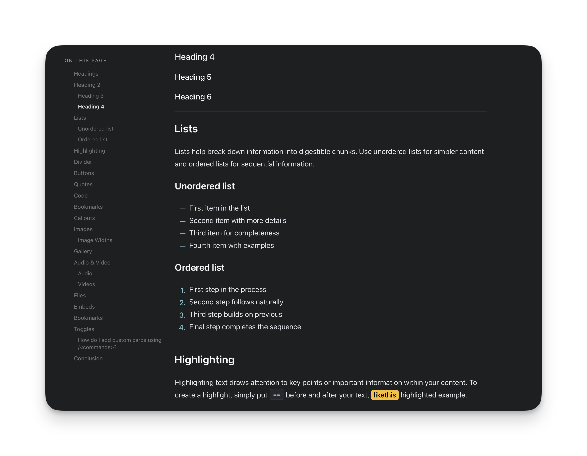
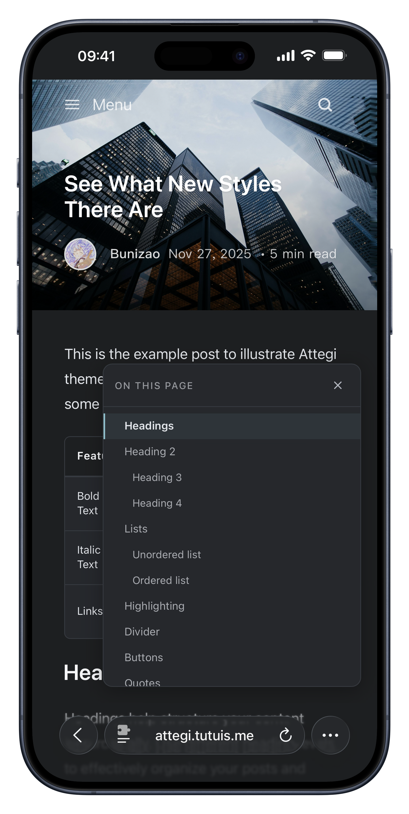

<div align="center">

# Attegi

[](https://ghost.org/)
[](LICENSE)
[](Gruntfile.js)
[](https://attegi.tutuis.me)

A modern, elegant Ghost theme focused on clean typography, mobile readability, and deep support for [Ghost](https://ghost.org).

**[View Live Demo →](https://attegi.tutuis.me)**

[简体中文](README_zh.md)


</div>

---

## Features

### Core Features

- **Dual Theme System** - Light/dark modes with automatic system detection
- **Mobile Design** - Fully responsive with native WebKit smooth scrolling
- **Modern Image Support** - AVIF/WebP format with automatic conversion
- **Code Syntax Highlighting** - Beautiful code blocks with one-click copy
- **Automatic Table of Contents** - Smart navigation with scroll spy
- **32 Languages** - Comprehensive internationalization support

### Content Features

- **Poem Cards** - Elegant poetry display with Markdown syntax support
- **Tags Page Template** - Custom page for browsing all tags with post counts
- **Links Page Template** - Friend links showcase with animated Möbius symbol
- **Enhanced Footnotes** - Improved navigation and styling
- **Not By AI Badge** - Optional transparency badge for human-created content
- **Portrait Image Detection** - Automatic layout optimization

### Performance & UX

- **Fast Loading** - Optimized assets with lazy loading
- **Glass Morphism UI** - Modern design with elegant animations
- **Smart Navigation** - Post navigation with intelligent fallbacks
- **Mobile Enhancements** - Auto-hide panels and touch-optimized interactions
- **Custom OG Images** - Optional Open Graph image service integration

---

## Performance

Attegi achieves excellent scores on [Google PageSpeed Insights](https://pagespeed.web.dev/analysis/https-attegi-tutuis-me/jhk5dugrrn):

| Metric | Mobile | Desktop |
|--------|--------|---------|
| Performance | 97 | 97 |
| Accessibility | 96 | **100** |
| Best Practices | **100** | **100** |
| SEO | **100** | **100** |

---

## Feature Details

### Poem Cards

> Display beautiful poetry with automatic Markdown parsing or custom HTML

```markdown
> [!poem] The Road Not Taken
> Two roads diverged in a yellow wood,
> And sorry I could not travel both
> And be one traveler, long I stood
>
> — Robert Frost
```

**Features:**
- Markdown syntax with `[!poem]` trigger
- Auto-adapts to light/dark themes
- Fully responsive design
- Centered layout and plain text style options
- Elegant hover effects

**[View Tutorial →](https://attegi.tutuis.me/poem-card-tutorial/)**

### Modern Image Support

> Next-gen image formats with automatic conversion

- AVIF & WebP automatic format detection
- Fully configurable
- Lazy loading
- Enhanced mobile touch interactions
- Lightbox gallery with `GLightbox`

### Table of Contents

> Smart navigation with scroll spy

- Auto-generated from post headings (H2-H6)
- Scroll spy with active section highlighting
- Desktop: Fixed sidebar, Mobile: Collapsible drawer
- Disable per-post with `#no-toc` internal tag

<details>
<summary>View screenshots</summary>

<p align="center">

</p>
<p align="center">

</p>
</details>

### Tags Page Template

> Browse all tags with post previews in a beautiful glass-morphism design

- Custom page template with scrollable tag list
- Glass-effect cards with elegant animations
- Shows post count for each tag
- Fully responsive design

**Setup:** Create a new page in Ghost Admin → Pages, set the slug to `tags`.

**[View Demo →](https://attegi.tutuis.me/tags/)**

### Links Page Template

> Showcase friend links with animated Möbius infinity symbol

- Custom page template with elegant header animation
- Supports Ghost's native bookmark cards
- Custom HTML link cards with rich metadata
- Beautiful grid layout with hover effects

**Setup:** Create a new page in Ghost Admin → Pages, set the slug to `links`.

### Code Blocks & Mobile Design

> Syntax highlighting with one-click copy

- Syntax highlighting via highlight.js
- Copy button for code snippets
- Language detection and display
- Optimized mobile viewing experience

<details>
<summary>View screenshots</summary>

<p align="center">

&nbsp;&nbsp;&nbsp;&nbsp;

</p>
</details>

### Not By AI Badge

> Optional badge for posts not created by AI

- Enable per-post with internal tag `#not-by-ai`
- Configurable badge link
- Seamlessly integrated into post layout

### Additional Enhancements

- **Footnote Navigation** - Enhanced styling and smooth scrolling
- **Open Graph Images** - Optional custom OG image service support
- **Portrait Detection** - Automatic layout optimization for portrait images
- **Auto-hide Panels** - Mobile floating panels hide during interactions
- **Glass Buttons** - Elegant liquid glass-effect buttons

<details>
<summary>View glass button examples</summary>

<p align="center">

</p>
</details>

---

## Quick Start

1. Download the latest version from [GitHub Releases](https://github.com/bunizao/Attegi/releases)
2. `Ghost Admin` → `Settings` → `Design` → `Upload Theme`
3. Activate `Attegi`
4. Enjoy!

---

## Customization

| Setting | Location |
|---------|----------|
| Accent color | Ghost Admin → Design & Branding |
| Hide elements | Code Injection (see below) |
| Styles/Scripts | Edit `src/sass` or `src/js`, then rebuild |

<details>
<summary><strong>Hide Elements via Code Injection</strong></summary>

```html
<style>
section.post-comments,
.post-share,
.nav-footer ul,
span.nav-credits,
span.nav-copy { display: none !important; }
</style>
```

</details>

---

## Development

<details>
<summary><strong>Prerequisites</strong></summary>

- Node.js 16+ and npm/yarn
- Ghost instance (local via Ghost CLI or remote dev site)
- Docker (optional)
- Git

</details>

<details>
<summary><strong>Hot Reload Without Docker</strong></summary>

```bash
# 1) Start Ghost (or use existing localhost:2368)
ghost start --development

# 2) In this theme repo, run hot dev (proxy + asset watchers)
npm run dev:hot

# 3) Open hot-reload URL (default port for this repo)
# http://localhost:3010
```

Optional environment variables:

```bash
# Ghost target URL (defaults to http://127.0.0.1:2368)
GHOST_DEV_URL=http://127.0.0.1:2368

# Hot-reload server port (defaults to 3010 in this repo)
DEV_HOT_PORT=3010
```

</details>

<details>
<summary><strong>Local Development with Docker</strong></summary>

```bash
docker-compose up -d
# Visit http://localhost:2368/ghost
# Activate theme in Settings → Design
```

</details>

<details>
<summary><strong>Build Commands</strong></summary>

```bash
npm run dev        # Watch mode (CSS + JS concurrent)
npm run dev:hot    # Hot reload via BrowserSync proxy
npm run build      # Production build
npm run compress   # Create zip
npm run validate   # Validate theme with GScan
npm run clean      # Remove build artifacts
```

</details>

<details>
<summary><strong>Project Structure</strong></summary>

```text
Attegi/
├── assets/        # Compiled (don't edit)
├── locales/       # 32 language files
├── partials/      # Template components
├── src/
│   ├── sass/      # Source styles
│   └── js/        # Modular ES modules
│       ├── core/      # Shared utilities
│       ├── features/  # Feature modules
│       └── entries/   # Bundle entry points
├── scripts/       # Build tools (esbuild)
├── *.hbs          # Templates
└── package.json
```

</details>

---

## Support

- **Docs**: [Ghost Theme Documentation](https://ghost.org/docs/themes/)
- **Issues**: [GitHub Issues](https://github.com/bunizao/Attegi/issues)
- **Discussions**: [GitHub Discussions](https://github.com/bunizao/Attegi/discussions)
- **Paid support & Customization**: Available for technical support and theme customization. [**email**](mailto:me@tutuis.me) me to discuss scope.

---

## License

GNU Affero General Public License v3.0. See [LICENSE](LICENSE).
