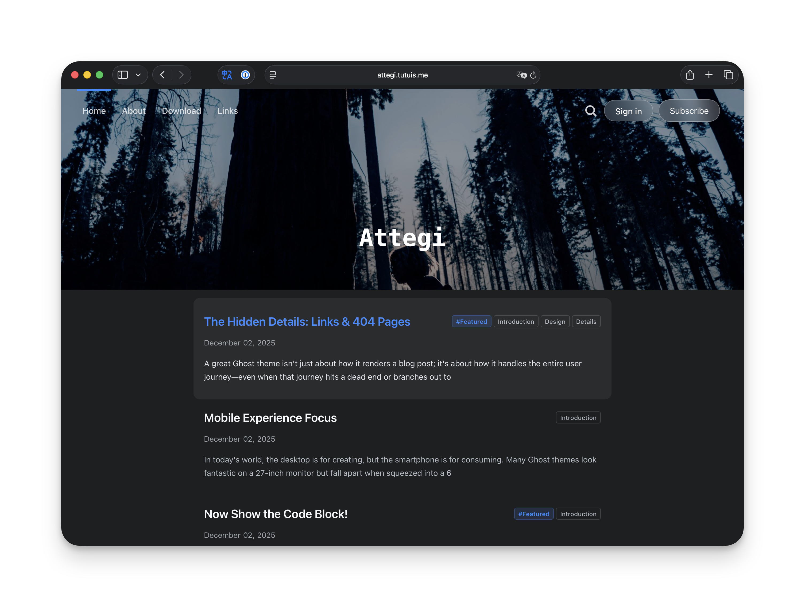
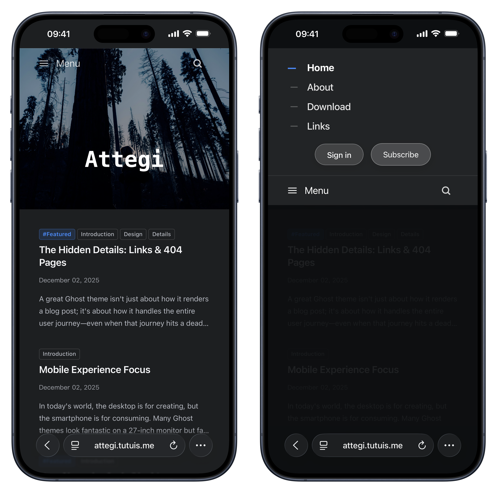
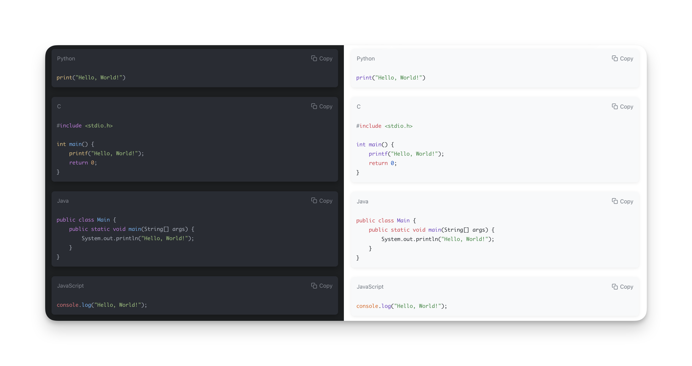
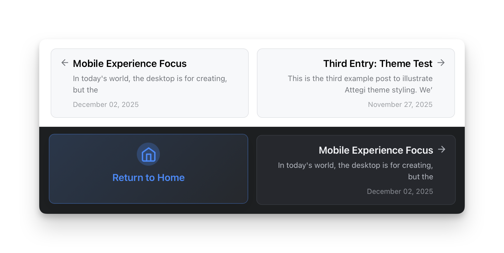
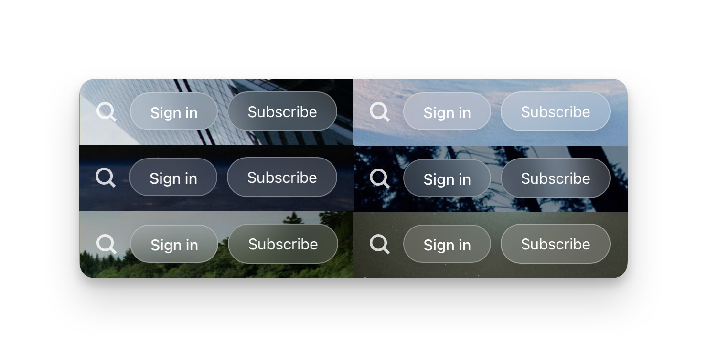

<div align="center">

# Attegi

[](https://ghost.org/)
[](LICENSE)
[](Gruntfile.js)
[](https://attegi.tutuis.me)

A modern, elegant Ghost theme focused on clean typography, mobile readability, and seamless dark/light mode switching.

**[View Live Demo →](https://attegi.tutuis.me)**

[简体中文](README_zh.md)



</div>

---

## Features

<table>
<tr>
<td width="50%">

### Core

- ✨ **Dual Theme** - Dark/light modes with system detection
- 📱 **Mobile First** - Optimized for all screen sizes
- 🎨 **Glass Effects** - Modern UI with elegant animations
- 💻 **Code Blocks** - Syntax highlighting + copy button

</td>
<td width="50%">

### Advanced

- 📑 **Auto TOC** - Table of contents with scroll spy
- 🧭 **Smart Nav** - Post navigation with home fallback
- 🌍 **32 Languages** - Full i18n support
- 🚀 **Fast** - Optimized assets & lazy loading

</td>
</tr>
</table>

---

## Screenshots

<table>
<tr>
<td width="50%" align="center">
<strong>Mobile Optimized</strong><br><br>

</td>
<td width="50%" align="center">
<strong>Code Blocks</strong><br><br>

</td>
</tr>
<tr>
<td width="50%" align="center">
<strong>Post Navigation</strong><br><br>

</td>
<td width="50%" align="center">
<strong>404 Page</strong><br><br>

</td>
</tr>
<tr>
<td colspan="2" align="center">
<strong>Glass Buttons</strong><br><br>

</td>
</tr>
</table>

### Table of Contents

Auto-generated TOC for long articles with:
- Desktop: Fixed sidebar with scroll spy
- Mobile: Floating panel with reading progress
- Disable per-post with `#no-toc` tag

### Performance

Excellent scores on [PageSpeed Insights](https://pagespeed.web.dev/analysis/https-attegi-tutuis-me/hzaz7busnt) for both mobile and desktop.

---

## Quick Start

```bash
# 1. Download from GitHub Releases
# 2. Ghost Admin → Settings → Design → Upload Theme
# 3. Activate Attegi
```

Or build from source:

```bash
git clone https://github.com/bunizao/Attegi.git
cd Attegi && yarn install
yarn build && yarn compress
# Upload dist/attegi.zip
```

---

## Customization

| Setting | Location |
|---------|----------|
| Accent color | Ghost Admin → Design & Branding |
| Hide elements | Code Injection (see below) |
| Styles/Scripts | Edit `src/sass` or `src/js`, then rebuild |

<details>
<summary><strong>Hide Elements via Code Injection</strong></summary>

```html
<style>
section.post-comments,
.post-share,
.nav-footer ul,
span.nav-credits,
span.nav-copy { display: none !important; }
</style>
```

</details>

---

## Development

<details>
<summary><strong>Prerequisites</strong></summary>

- Node.js 16+ and npm/yarn
- Docker (optional)
- Git

</details>

<details>
<summary><strong>Local Development with Docker</strong></summary>

```bash
docker-compose up -d
# Visit http://localhost:2368/ghost
# Activate theme in Settings → Design
```

</details>

<details>
<summary><strong>Build Commands</strong></summary>

```bash
yarn dev        # Watch mode
yarn build      # Production build
yarn compress   # Create zip
npx gscan .     # Validate theme
```

</details>

<details>
<summary><strong>Project Structure</strong></summary>

```
Attegi/
├── assets/        # Compiled (don't edit)
├── locales/       # 32 language files
├── partials/      # Template components
├── src/
│   ├── sass/      # Source styles
│   └── js/        # Source scripts
├── *.hbs          # Templates
└── package.json
```

</details>

---

## Support

- **Docs**: [Ghost Theme Documentation](https://ghost.org/docs/themes/)
- **Issues**: [GitHub Issues](https://github.com/bunizao/Attegi/issues)
- **Discussions**: [GitHub Discussions](https://github.com/bunizao/Attegi/discussions)
- **Email**: [me@tutuis.me](mailto:me@tutuis.me)

---

## License

MIT (inherits from [Attila](https://github.com/zutrinken/attila)). See [LICENSE](LICENSE).
