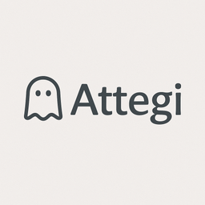

# Attegi
[](https://ghost.org/)
[](LICENSE)
[](Gruntfile.js)
[](https://Attegi.tutuis.me)

一款注重排版与移动端可读性的 Ghost 主题，基于 [Attila](https://github.com/zutrinken/attila) 打磨，并借鉴 Moegi 的风格细节。



[English](README.md)

---

## 特点
- 移动端友好：更紧凑的字体与间距，列表卡片在手机上依然清晰易读。
- 深浅色精调：暗/亮模式的舒适配色，强调色状态统一，作者/日期元信息更一致。
- Liquidglass 质感：卡片和 meta 模块带轻盈的玻璃态悬停效果，增加层次感。
- 细节优化：图片说明、柔和阴影、精选星标、响应式视频容器等。
- 兼容 Attila：保留 Attila 的所有核心能力，可直接使用其辅助与区块。

---

## 快速开始
- 下载发布 zip（`npx grunt compress` 或 GitHub zip）。
- 在 Ghost 后台 → 设计 → 上传主题 → 启用。
- 本地开发请见下方 **Development**。

---

## 自定义
- **强调色**：Ghost 后台 → 设计与品牌 → 强调色（可单独设置深色模式强调色）。
- **隐藏区块**（代码注入）：
```html
<style>
section.post-comments,
.post-share,
.nav-footer ul,
span.nav-credits,
span.nav-copy { display: none !important; }
</style>
```
- **修改样式/脚本**：只改 `src/sass`、`src/js`，再构建；不要直接改 `assets/`。

---

## 项目结构
- 模板：根目录 `.hbs` 与 `partials/`
- 源码：`src/sass`、`src/js` → 编译到 `assets/`
- 打包：`npx grunt compress` 产出 `dist/attegi.zip`

---

## 示例
https://Attegi.tutuis.me

---

## 许可证
MIT（继承自 Attila），见 `LICENSE`。

---

<details>
<summary><strong>Development</strong></summary>

1) **安装依赖**
```bash
npm install
```

2) **本地启动 Ghost（SQLite）**
```bash
docker-compose up -d          # 启动 Ghost，并挂载此仓库为主题
```
打开 `http://localhost:2368/ghost` 启用主题。

3) **开发时实时构建**
```bash
npx grunt                     # 监听 src/sass 和 src/js，输出到 assets/
```

4) **打包上传**
```bash
npx grunt build && npx grunt compress   # 生成 dist/attegi.zip
```

5) **同步到本地运行中的 Ghost 并重启**
```bash
rsync -av --delete --exclude '.git' --exclude 'node_modules' --exclude 'dist' ./ /Users/tutu/Ghost/themes/attegi/ \
  && docker-compose restart ghost
```

</details>
